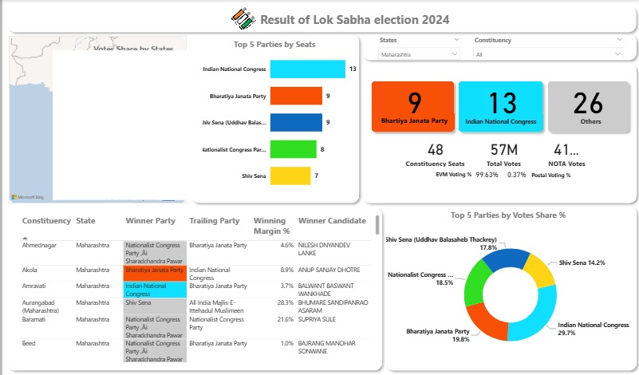

# 🗳️ Lok Sabha Election 2024 – Power BI Dashboard  

## 📌 Project Overview  
This project presents an **interactive Power BI dashboard** for analyzing the **Lok Sabha Election 2024 results** with a focus on the state of **Maharashtra**. The dashboard provides insights into seats won by political parties, vote shares, winning margins, and constituency-level performance.  

The aim of the project is to create a **visual, data-driven analysis tool** that simplifies election results interpretation for stakeholders, journalists, researchers, and the public.  

---

## 🚀 Features  
- 📊 **Top 5 Parties by Seats & Votes** – Clear breakdown of parties with highest wins.  
- 🏆 **Party Performance** – Bharatiya Janata Party (9), Indian National Congress (13), Others (26).  
- 📅 **Constituency-wise Results** – Display of winner party, trailing party, winning margin %, and winning candidate.  
- 📈 **Vote Share Analysis** – Pie chart representation of top 5 parties by vote share %.  
- 🌍 **Geographic View** – Map integration to track results across states and constituencies.  
- 🔍 **Filters** – Dynamic filtering by **State** and **Constituency** for easy exploration.  
- 🧾 **Key Metrics** – Total votes: **57M**, Total constituencies: **48**, NOTA votes: **41k**.  

---

## 🛠️ Tools & Technologies  
- **Power BI** – Dashboard creation & visualization  
- **Excel/CSV Dataset** – Election results data  
- **Power Query** – Data cleaning & transformation  

---
 
## 📊 Dataset Information  
The dataset includes the following fields:  

| Column             | Description |
|--------------------|-------------|
| election_year      | Year of the election |
| state_name         | Name of the state |
| constituency_name  | Name of the parliamentary constituency |
| constituency_type  | Type of constituency (General/SC/ST) |
| party_name         | Political party name |
| candidate_name     | Name of the contesting candidate |
| EVM_votes          | Votes polled via Electronic Voting Machines |
| postal_votes       | Votes polled via postal ballots |
| total_votes        | Combined votes (EVM + postal) |
| rank               | Candidate rank in the constituency (1 = winner) |
| units              | Vote unit counts / standard measure |

---

## 📈 Key Insights  
- Indian National Congress secured **13 seats**, the highest in Maharashtra.  
- Bharatiya Janata Party and Shiv Sena (Uddhav faction) won **9 seats each**.  
- **Vote share analysis** shows Indian National Congress leading with **29.7%**, followed by BJP (**18.8%**) and Shiv Sena (**17.8%**).  
- Winning margins varied across constituencies, reflecting both close and landslide victories.  

---

## 📂 Repository Structure  
📁 Lok-Sabha-Election-2024-Dashboard
│-- 📄 README.md

│-- 📊 ElectionAnalysisDashboard.pbix # Power BI dashboard file

│-- 📑 Dataset.xlsx # Dataset (if shareable)

│-- 📷 Dashboard,jpg # Dashboard preview

---

## ⚡ How to Use  
1. **Clone or Download** this repository.  
2. Open the `Lok_Sabha_Election_2024.pbix` file in **Power BI Desktop**.  
3. If dataset is available (`Election_Data.xlsx`):  
   - Keep it in the same folder as the `.pbix` file.  
   - Open Power BI → Click **Refresh** to load the latest data.  
4. Use filters to analyze results by **State** or **Constituency**.  
5. Explore seats, vote shares, and candidate-level performance interactively.  
6. Optionally, publish the report to **Power BI Service** for online access.  

---

## 📷 Dashboard Preview  
  

---

## 🎯 Conclusion  
The **Lok Sabha Election 2024 Power BI Dashboard** demonstrates how electoral data can be transformed into **interactive visual insights**. It enables users to easily track party performance, understand voting trends, and analyze results across constituencies, improving transparency and decision-making.  
